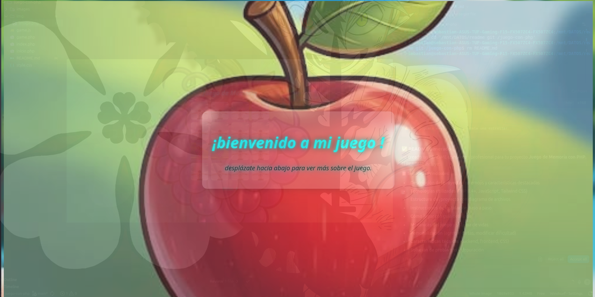
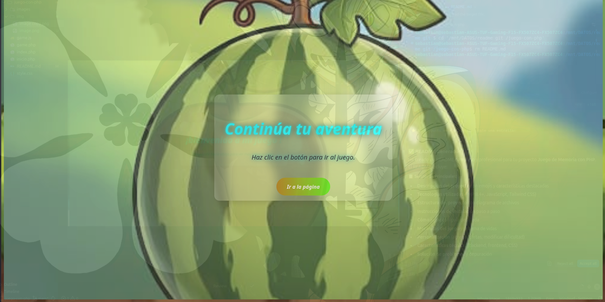
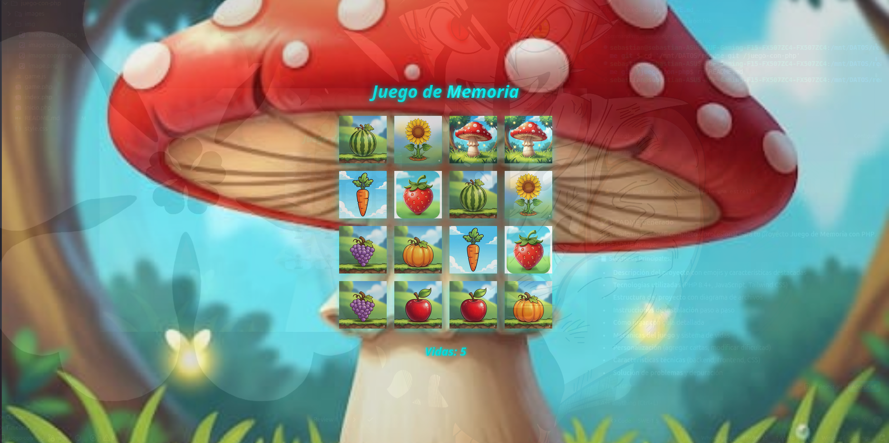
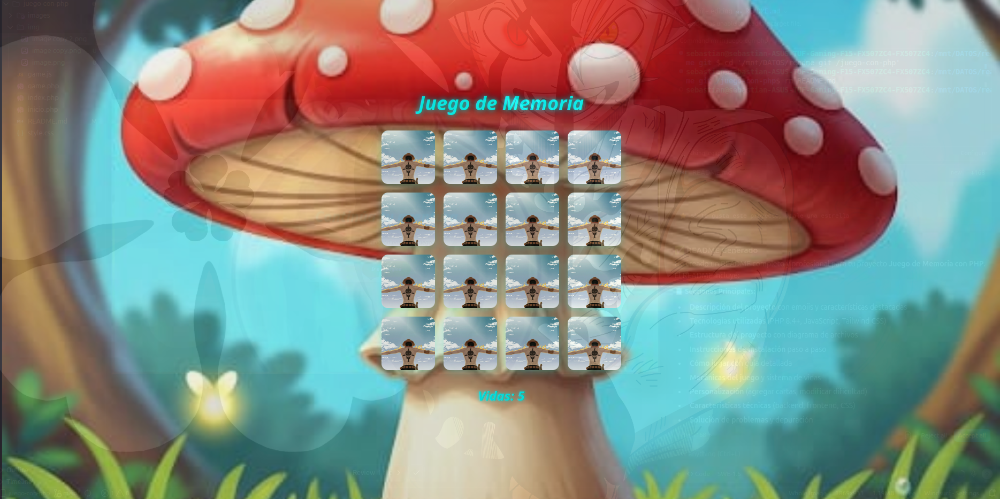
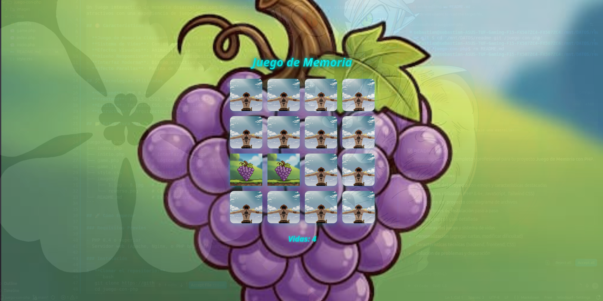
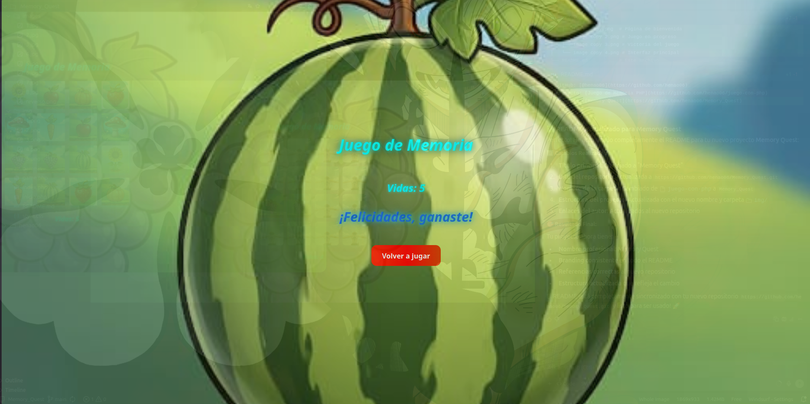

# Memory Quest

<div align="center">
  
</div>

Un juego interactivo de memoria desarrollado con PHP, JavaScript y CSS que combina efectos visuales atractivos con una experiencia de juego divertida.

## Características

- **Juego de Memoria Clásico**: Encuentra pares de cartas idénticas
- **Sistema de Vidas**: Comienza con 5 vidas por partida
- **Efectos Visuales**: Animaciones suaves y transiciones elegantes
- **Diseño Responsivo**: Funciona en dispositivos móviles y escritorio
- **Interfaz Moderna**: Diseño atractivo con Tailwind CSS
- **Efecto Parallax**: Página de bienvenida con scroll animado

## Tecnologías Utilizadas

- **Backend**: PHP 8.4+
- **Frontend**: HTML5, CSS3, JavaScript (ES6+)
- **Estilos**: Tailwind CSS, CSS3 Animations
- **Estructura**: Arquitectura MVC ligera

## Estructura del Proyecto

```
Memory_Quest/
├── index.php          # Página principal con efecto parallax
├── inicio.php          # Interfaz del juego
├── game.php            # Lógica del tablero (API)
├── game.js             # Lógica del juego en JavaScript
├── style.css           # Estilos personalizados
├── images/             # Cartas del juego
│   ├── 1.jpg - 8.jpg   # Cartas del juego
│   └── reverso.png     # Cara posterior de las cartas
├── img/                # Capturas de pantalla
│   ├── 1.png           # Vista principal del juego
│   ├── 2.png           # Página de bienvenida
│   ├── 3.png           # Juego en progreso
│   ├── 4.png           # Victoria del juego
│   ├── 5.png           # Interfaz principal
│   └── 6.png           # Captura adicional
└── README.md           # Este archivo
```

## 🚀 Cómo Empezar

### Requisitos Previos

- PHP 8.4 o superior
- Servidor web (Apache, Nginx, o PHP built-in server)

### Instalación

1. **Clonar el repositorio:**
   ```bash
   git clone https://github.com/henao06/Memory_Quest.git
   cd Memory_Quest
   ```

2. **Iniciar el servidor:**
   ```bash
   # Opción 1: Usar PHP built-in server
   php -S localhost:8080
   
   # Opción 2: Configurar en Apache/Nginx
   # Apuntar el document root a la carpeta del proyecto
   ```

3. **Abrir en el navegador:**
   ```
   http://localhost:8080
   ```

## Cómo Jugar - Guía Paso a Paso

### 1. Página de Bienvenida
<div align="center">
  
  <p><em>Lo primero que se abre - Página de bienvenida con efecto parallax</em></p>
</div>

### 2. Continúa la Aventura
<div align="center">
  
  <p><em>Haciendo scroll y yendo al juego</em></p>
</div>

### 3. El Juego se Abre
<div align="center">
  
  <p><em>Se abre el juego y me muestra las cartas</em></p>
</div>

### 4. Las Cartas se Esconden
<div align="center">
  
  <p><em>Las cartas se voltean y se esconden</em></p>
</div>

### 5. Cómo se Juega
<div align="center">
  
  <p><em>Le das click a una y se voltea, al voltear las iguales se quedan en la pantalla</em></p>
</div>

### 6. Ganaste
<div align="center">
  
  <p><em>Gané, me felicita y aparece el botón de volver a jugar</em></p>
</div>

## Mecánicas del Juego

- **Vidas**: Comienzas con 5 vidas
- **Pares**: Encuentra todos los pares de cartas
- **Pérdida de Vidas**: Pierdes una vida por cada par incorrecto
- **Victoria**: Encuentra todos los pares antes de quedarte sin vidas
- **Animaciones**: Efectos suaves al voltear las cartas
- **Sistema de Puntos**: Rastrea tu progreso en tiempo real

## Personalización

### Agregar Nuevas Cartas

1. Añade nuevas imágenes a la carpeta `images/`
2. Nómbralas secuencialmente (ej: `9.jpg`, `10.jpg`)
3. El juego detectará automáticamente las nuevas cartas

### Modificar Dificultad

Edita las variables en `game.js`:
```javascript
let vidas = 5;  // Cambiar número de vidas
```

### Personalizar Estilos

Modifica `style.css` para cambiar:
- Colores del tema
- Animaciones
- Tamaños de las cartas
- Efectos visuales

## Características Técnicas

### Backend (PHP)

- **Detección Dinámica**: Escanea automáticamente las imágenes en la carpeta `images/`
- **Generación de Tablero**: Crea pares y mezcla las cartas aleatoriamente
- **API REST**: Endpoint `game.php` que devuelve el tablero en formato HTML

### Frontend (JavaScript)

- **Estado del Juego**: Manejo completo del estado de la partida
- **Animaciones**: Transiciones suaves al voltear cartas
- **Lógica de Validación**: Comprobación de pares y gestión de vidas
- **Interfaz Dinámica**: Actualización en tiempo real del UI

### CSS

- **Animaciones 3D**: Efecto de volteo realista de cartas
- **Responsive Design**: Adaptación a diferentes tamaños de pantalla
- **Efectos Parallax**: Scroll animado en la página principal
- **Transiciones Suaves**: Animaciones fluidas y profesionales

## Solución de Problemas

### Problemas Comunes

1. **Imágenes no cargan**: Verifica que las imágenes estén en la carpeta `images/`
2. **Server error**: Asegúrate de tener PHP 8.4+ instalado
3. **404 errors**: Verifica la configuración del servidor web

### Depuración

- **Consola del navegador**: Revisa errores JavaScript en F12
- **PHP errors**: Habilita display_errors en desarrollo
- **Logs del servidor**: Revisa error_log para problemas del servidor

## Contribuir

¡Las contribuciones son bienvenidas!

1. Fork del proyecto
2. Crear una nueva rama (`git checkout -b feature/nueva-caracteristica`)
3. Commit de los cambios (`git commit -am 'Agregar nueva característica'`)
4. Push a la rama (`git push origin feature/nueva-caracteristica`)
5. Crear un Pull Request

## Licencia

Este proyecto está bajo la Licencia MIT. Consulta el archivo `LICENSE` para más detalles.

## Autor

<div align="center">
  
</div>

**Sebastian Henao**
- GitHub: [@henao06](https://github.com/henao06)
- Proyecto: [Memory Quest](https://github.com/henao06/Memory_Quest)

## Agradecimientos

- Tailwind CSS por el framework de estilos
- Comunidad PHP por las mejores prácticas
- Diseñadores de las imágenes utilizadas

---

<div align="center">
  <p>Si te gusta este proyecto, ¡dale una estrella!</p>
  <p>¡Diviértete jugando y mejorando tu memoria!</p>
</div>
